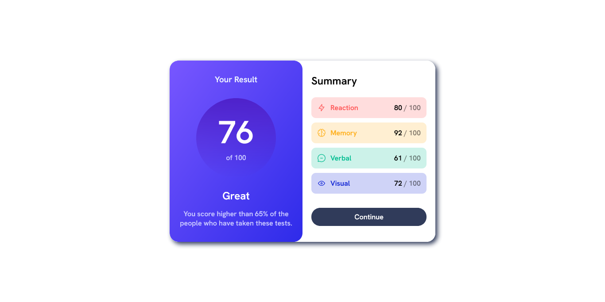

# Frontend Mentor - Results summary component solution

This is a solution to the [Results summary component challenge on Frontend Mentor](https://www.frontendmentor.io/challenges/results-summary-component-CE_K6s0maV). Frontend Mentor challenges help you improve your coding skills by building realistic projects.

## Table of contents

- [Overview](#overview)
  - [Links](#links)
  - [Screenshot](#screenshot)
- [My process](#my-process)
  - [Built with](#built-with)
  - [What I learned](#what-i-learned)
  - [Continued development](#continued-development)
- [Author](#author)

## Overview

### Links

- Solution URL: [GitHub URL](https://github.com/elameendaiyabu/Result-Summary-Site.git)
- Live Site URL: [Netlify Site](https://result-summary-site1.netlify.app/)

<!-- ### Screenshot

<!--  -->

 -->

## My process

### Built with

- Semantic HTML5 markup
- CSS custom properties
- Flexbox

### What I learned

I learned more on making mobile responsive apps and flex boxes

### Continued development

- make site dynamic

## Author

- Frontend Mentor -
  [@elameendaiyabu](https://www.frontendmentor.io/profile/elameendaiyabu)
- Twitter - [@elameendk](https://www.twitter.com/elameendk)
